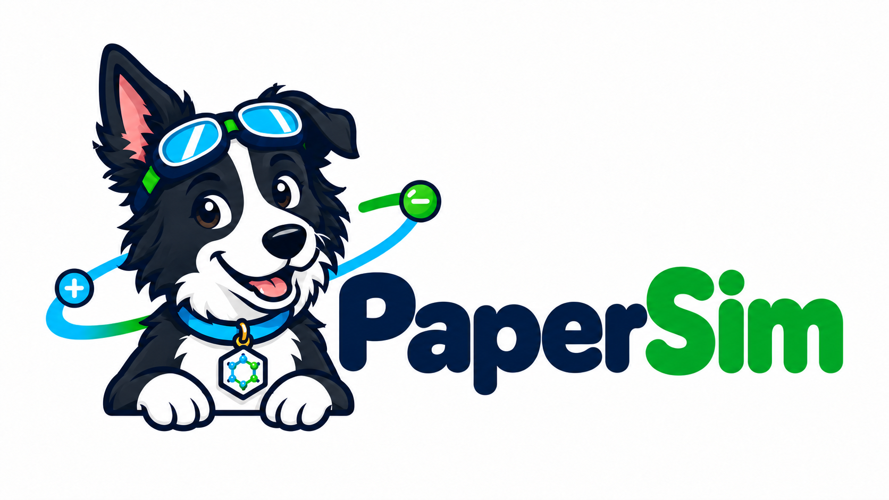
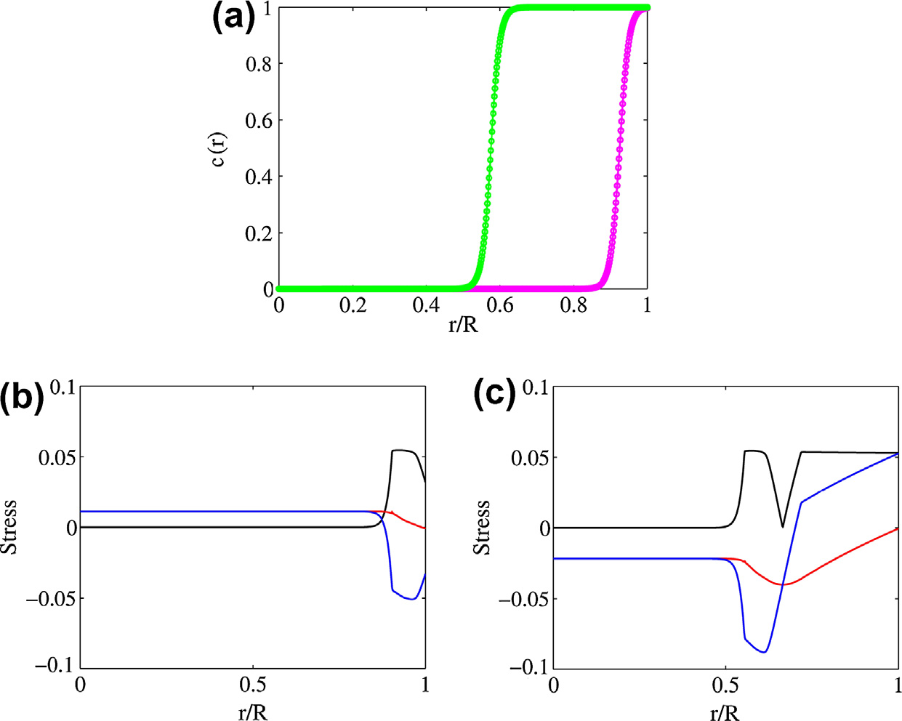
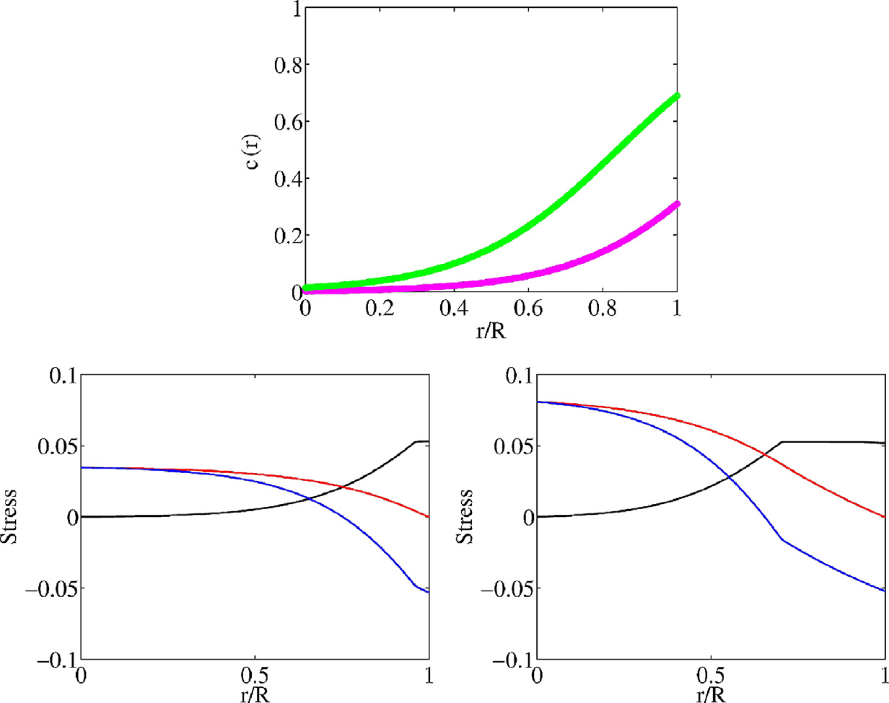
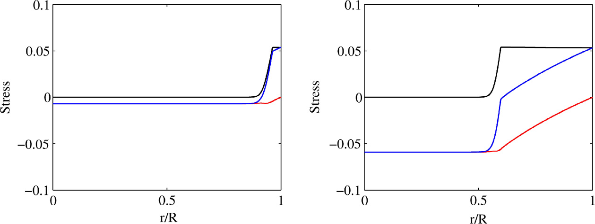
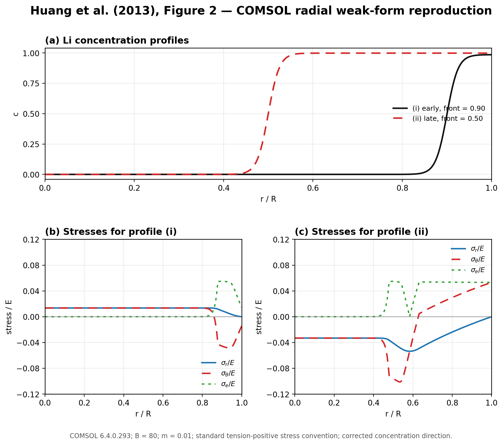
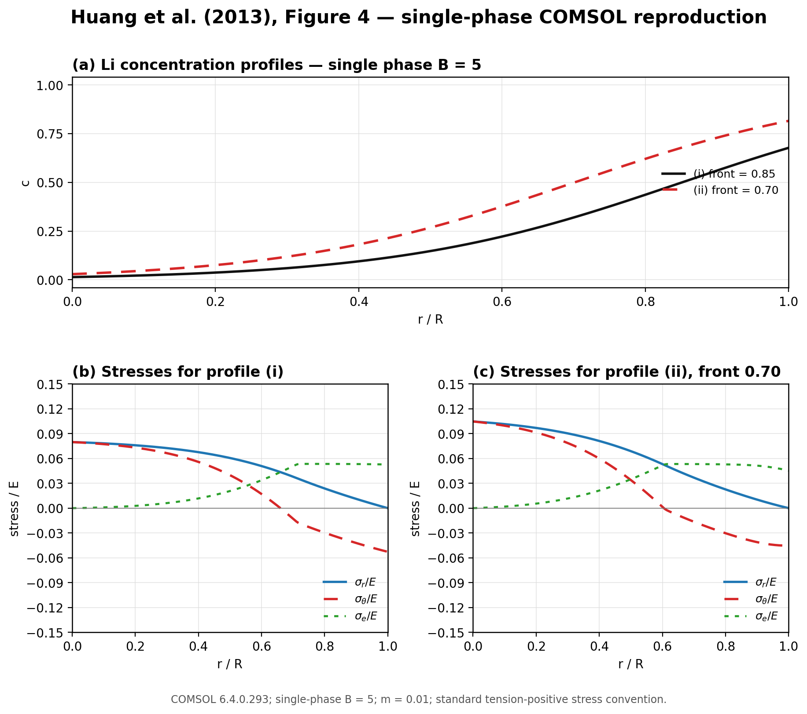
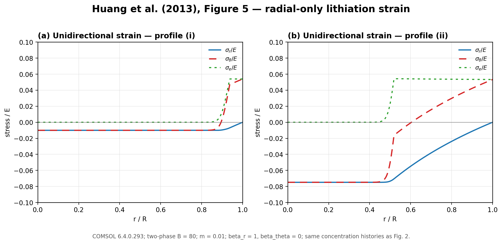
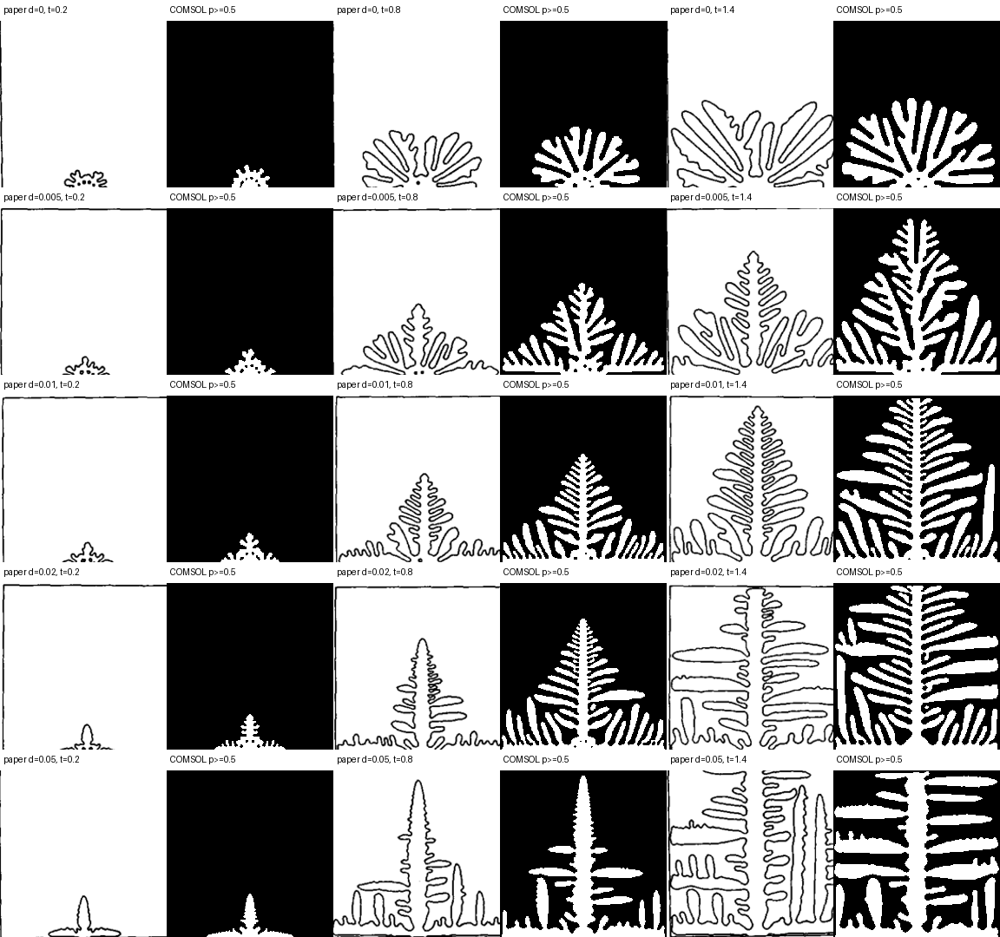

<p align="center">
  
</p>

<p align="center">
  <strong>数值模型复现核心：可建模、可诊断、可修正、可审计</strong>
</p>

PaperSim 旨在对理论模型开展复现审计，其工作对象包括论文以及具有完整理论阐述的技术报告。项目以 Case 模式对每项任务进行迭代，并采用“LLM 推理理解 + Python 脚本规范化/结构化”的执行框架。其中，Python 负责规范化、证据校验、状态推进、外部solver调用、数值检查、结果比较与报告生成；LLM 不参与核心事实写入，仅作为外部适配器提出候选草稿，如：辅助理解文献语义、提炼候选信息、生成结构化草稿或实现建议，但其输出必须经过 Python 侧的规则约束与证据链校验后，方可进入 Case 的正式流程。

## 核心原则

1. **Case 目录是唯一事实源。** 每个 Case 的论文、IR、审计、Java、MPH 和结果都保存在同一目录。
2. **`iterNNN_ir.json` 是该轮唯一模型事实源。** Java、审计和报告都必须绑定它的 SHA-256。
3. **无证据不进入 IR，未审计不批准，未批准不构建。**
4. **Build-only 与 solve-only 分离。** Build 只保存未求解 MPH；Solve 只加载 built MPH、求解和导出。
5. **COMSOL 正常退出不等于复现成功。** 必须读回模型并检查终点、残差/日志、守恒、场值、收敛和论文观测量。
6. **LLM 可替换。** 核心 Python 路径在没有 LLM、网络模型或 Agent 的情况下可完整运行。
7. **每个功能独立测试。** 每个功能都要有单元、契约、失败样例和端到端门禁测试。

## 当前状态

PaperSim 当前版本为 `0.2.0`，首个 canonical MVP 是 Kobayashi 1993 的 Eq. (3)-(5) 与 Fig. 7。核心 Python 路径、IR 审计、批准门禁、COMSOL build/solve 分离、MPH 读回、数值审计框架和离线 HTML 报告已经实现。真实数值验收必须完成求解与 12 项验收后才能由 `assess` 形成最终 verdict。

## 安装与快速验证

```bash
git clone <repository-url>
cd PaperSim
python3 -m venv .venv
source .venv/bin/activate
python3 -m pip install -e '.[test,pdf,extraction]'
papersim --help
python3 -m pytest -m "not pdf and not comsol"
```

仅安装核心运行依赖时使用：

```bash
python3 -m pip install -e .
```

PDF 解析和单位检查需要 `pdf,extraction` extras；真实 COMSOL 需要外部求解器或远程网关。

## 工作流程

```text
论文与任务登记
      │ Python 记录来源、哈希、复现目标
      ▼
现有 PDF 解析 ── Python 提取；LLM 辅助理解和提出候选
      │
      ▼
iterNNN_ir.json ── IR (Intermediate Representation) 是每轮模型的唯一事实源
      │
      ├── Python 确定性审计：证据、值、单位、符号、方程和缺口
      ├── LLM 审查：提出歧义、遗漏和未说明条件
      └── 人工批准：处理阻塞项；LLM 不负责批准
      │
      ▼
COMSOL 建模 ── 既有建模 skill / Java 生成器；Build 保存未求解 MPH
      │
      ▼
COMSOL 实现审计 ── 读回 MPH，核对其是否符合批准 IR
      │ 通过后
      ▼
独立求解 ── COMSOL 求解；Python 检查终点、收敛、守恒和场值
      │
      ▼
结果比较 ── Python 对齐论文观测与 COMSOL 输出；LLM 可提出差异解释
      │
      ├── 通过：形成有范围限定的复现评估
      └── 不一致：记录原因与未决问题；需要修改时进入 iterNNN+1
```

## Case 目录

```text
PaperSimWorkspace/
└── kobayashi1993_dendrite/
    ├── kobayashi1993_dendrite_paper.pdf
    ├── case.json
    ├── iter001_ir.json
    ├── iter001_audit.json
    ├── iter001_build.java
    ├── iter001_solve.java
    ├── iter001_built.mph
    ├── iter001_solved.mph
    ├── iter001_run.log
    ├── iter001_results.csv
    ├── iter001_snapshot.json
    ├── kobayashi1993_dendrite_iter001_assets/
    └── report.html
```
### 文件清单

`iterNNN` 表示整体审计迭代轮次，例如 `iter001`、`iter002`。Case 级文件供所有轮次共用；每轮文件独立保留。文件名中的 `NNN` 只用于区分轮次，不代表同一轮内的阶段顺序。

| 范围 | 文件 | 格式 | 说明 |
|---|---|---|---|
| Case 级 | `<case_id>_paper.pdf` | PDF | 论文原文；作为所有迭代共同的证据来源，保留原件。 |
| Case 级 | `case.json` | JSON | Case 定义：论文与补充材料来源、文件哈希、复现目标和验收条件。 |
| Case 级 | `report.html` | HTML | 汇总各轮模型、审计、比较和评估结果；由结构化记录生成。 |
| 每轮 | `iterNNN_ir.json` | JSON | 本轮 IR，包含模型事实、参数、方程、边界、初值、输出及其证据关联；是本轮唯一模型事实源。 |
| 每轮 | `iterNNN_audit.json` | JSON | 本轮阶段性审计记录：IR 检查、人工批准、COMSOL 实现核验、数值检查、结果比较、差异和评估。 |
| 每轮 | `iterNNN_build.java` | Java | 根据本轮批准的 IR 构建 COMSOL 模型；只保存未求解 MPH。 |
| 每轮 | `iterNNN_solve.java` | Java | 加载 built MPH，独立求解并导出结果；不重建参数或物理模型。 |
| 每轮 | `iterNNN_built.mph` | COMSOL MPH | Build 阶段保存的未求解模型，用于持久化属性读回和实现审计。 |
| 每轮 | `iterNNN_solved.mph` | COMSOL MPH | Solve 阶段产生的求解模型；与未求解模型分开保留。 |
| 每轮 | `iterNNN_run.log` | 文本日志 | 本轮构建、MPH 核验、求解和导出过程的日志。 |
| 每轮 | `iterNNN_results.csv` | CSV | 本轮用于论文结果比较和必要数值检查的导出数据。 |

## Python 契约

核心 Pydantic v2 模型和 JSON Schema：

- `CaseManifest`：Case 身份、论文哈希、目标和 legacy artifact；
- `ProfileModel`：确定性论文 profile，包括证据、参数、变量、方程和验收规则；
- `IR`：由 profile 和 PDF 证据生成的本轮模型事实源；
- `AuditRecord`：IR 检查、批准、COMSOL snapshot、数值检查和最终评估；
- `CheckResult`：统一使用 `pass / fail / unknown / not_applicable`。

导出 schema：

```bash
papersim schemas schemas/
```

批准记录绑定 paper、profile、IR、IR audit 和规则版本哈希。任意输入变化都会使批准失效。

## 工作流

### 1. 建立 Case

```bash
papersim --workspace /path/to/PaperSimWorkspace case init \
  --surname Kobayashi \
  --year 1993 \
  --topic dendrite \
  --paper /path/to/paper.pdf \
  --title "Modeling and numerical simulations of dendritic crystal growth" \
  --goal "Reproduce Eqs. (3)-(5) and Fig. 7"
```

### 2. 创建轮次并建立 IR

```bash
papersim --workspace /path/to/PaperSimWorkspace iteration \
  kobayashi1993_dendrite --iteration 1

papersim --workspace /path/to/PaperSimWorkspace extract \
  kobayashi1993_dendrite --iteration 1 \
  --profile profiles/kobayashi1993_dendrite.json
```

`extract` 会校验 PDF 哈希、页码、bbox、quote、单位、符号闭包、方程分类和完备性。任一关键检查失败时不写正式 IR。

### 3. 人工批准

```bash
papersim --workspace /path/to/PaperSimWorkspace approve \
  kobayashi1993_dendrite --iteration 1 \
  --approved-by "human:reviewer" \
  --reason "Evidence and assumptions reviewed"
```

测试夹具可以显式使用 `--test-only` 和 `test-only:` 身份；真实 Case 不应使用测试批准。

### 4. 生成 Java 和记录 Build

```bash
papersim --workspace /path/to/PaperSimWorkspace build \
  kobayashi1993_dendrite --iteration 1
```

只生成 Java 时到此停止。真实 build 完成后记录 MPH：

```bash
papersim --workspace /path/to/PaperSimWorkspace build \
  kobayashi1993_dendrite --iteration 1 \
  --mph /path/to/iter001_built.mph \
  --status complete --exit-code 0 \
  --log-file /path/to/build.log
```

Python 验证批准哈希、MPH 非空和 build 状态。Build Java 不允许调用 `runAll()` 或保存 solved MPH。

### 5. 读回 MPH 并审计实现

```bash
papersim --workspace /path/to/PaperSimWorkspace audit-implementation \
  kobayashi1993_dendrite --iteration 1 --from-mph
```

`--from-mph` 直接读取 MPH 内的 `smodel.json`、`dmodel.xml` 和模型设置，核对参数、变量表达式和描述、物理接口、单位、边界、初值、网格、参数扫描、求解器和终点，并写入 `iterNNN_snapshot.json`。未通过时不能进入正式 Solve。

### 6. 独立 Solve 与数值审计

```bash
papersim --workspace /path/to/PaperSimWorkspace solve \
  kobayashi1993_dendrite --iteration 1 \
  --mph /path/to/iter001_solved.mph \
  --status complete --exit-code 0 \
  --log-file /path/to/solve.log

papersim --workspace /path/to/PaperSimWorkspace audit-numeric \
  kobayashi1993_dendrite --iteration 1 \
  --raw-csv /path/to/comsol_table.csv \
  --metrics-json '{"time.max": 1.4}'
```

`iterNNN_results.csv` 是规范化长表：

```text
case_id,iteration,stage,source,delta,time,metric,value,unit
```

### 7. 评估和报告

```bash
papersim --workspace /path/to/PaperSimWorkspace assess \
  kobayashi1993_dendrite --iteration 1

papersim --workspace /path/to/PaperSimWorkspace report \
  kobayashi1993_dendrite --iteration 1
```

报告为完全离线的 `report.html`：内嵌 CSS、静态 HTML 数学表达、本地图片，不依赖 CDN、MathJax 或外部 JavaScript。报告包含：

- 原文参数和证据；
- 方程分类与 equation-to-feature mapping；
- Nomenclature；
- 边界和初值；
- 网格、求解器和参数扫描；
- IR、COMSOL 实现和数值审计；
- Fig. 7 比较、假设和限定 verdict。

## Kobayashi1993 MVP

首个 MVP Case 为：

```text
kobayashi1993_dendrite
```

范围是 Eq. (3)-(5) 与 Fig. 7 的 `delta` 扫描：

```text
delta = 0, 0.005, 0.01, 0.02, 0.05
tfinal = 1.4
comparison times = 0.2, 0.8, 1.4
```

12 项 required 验收包括：

- final MPH 非空；
- COMSOL 日志无 fatal error；
- phase field 上下界；
- 焓守恒；
- 网格、时间步和 seed 敏感性；
- 各向异性增强尖端生长；
- 四重方向性；
- Fig. 7 IoU 和 normalized Chamfer。

论文未提供 random seed 和 nucleation radius，因此 profile 将这些补全明确标记为 assumption。最终 verdict 预期为 `qualified`，而不是无条件的 `supported`。

旧 `kobayashi1993.mph`、旧图表和旧报告已迁移为 legacy artifact，只作为历史证据，不构成新 `iter001` 的独立验收。

## 测试

默认离线门禁：

```bash
python3 -m pytest -m "not pdf and not comsol"
```

真实 PDF：

```bash
PAPERSIM_KOBAYASHI_PDF=/path/to/kobayashi1993_dendrite_paper.pdf \
  python3 -m pytest -m pdf
```

真实 COMSOL/远程网关集成：

```bash
python3 -m pytest -m comsol
```

测试分为四层：

1. 纯函数和 Pydantic 契约单元测试；
2. JSON schema、哈希和 canonical artifact 契约测试；
3. 篡改、越权、过期批准和错误 snapshot 的失败测试；
4. fake solver 的 Case→IR→批准→build→solve→audit→assess→report 端到端测试。

功能与测试映射见 [feature matrix](docs/feature_matrix.md)。

## COMSOL 规则

所有 Java/MPH 工作继续遵守 [comsol-modeling skill](skills/comsol-modeling/SKILL.md)：

- 控制方程只放在 PDE/ODE；
- 本构关系和辅助关系放在 named Variables；
- 所有参数变化使用单个 Parametric Sweep；
- 每个 Variable 必须有 Description；
- PDE/ODE 必须声明 dependent-variable 和 flux/source 单位；
- Build 和 Solve 必须是不同源码和不同作业。

连接信息、凭据、分区和远端路径只存在于外部配置，不进入 profile、IR、Java 或报告。

## 公开仓库安全边界

`PaperSim` 不在仓库内保存主机名、账号、密码、私钥、实例 ID、分区或远端绝对路径。这些信息必须通过外部 mode-`0600` 配置文件注入。`.gitignore` 会排除本地虚拟环境、构建产物、MPH、日志、CSV、密钥和凭据文件。


## Gallery: Huang 2013 Figure Reproduction

The gallery compares the source figures extracted from the Huang et al. (2013) paper with the corrected PaperEngine reproduction results. Figure 2 uses the corrected concentration direction; Figure 4(c) uses `front=0.70` to preserve the yield plateau; Figure 5 uses the unidirectional swelling branch `beta_r=1, beta_theta=0`.

<table>
  <thead>
    <tr>
      <th align="center">Figure 2: two-phase concentration and stress</th>
      <th align="center">Figure 4: single-phase stress</th>
      <th align="center">Figure 5: unidirectional lithiation</th>
    </tr>
  </thead>
  <tbody>
    <tr>
      <td align="center" width="33%"><a href="docs/gallery/huang2013/figure2_original.png"></a><br><sub>Original Figure 2</sub></td>
      <td align="center" width="33%"><a href="docs/gallery/huang2013/figure4_original.png"></a><br><sub>Original Figure 4</sub></td>
      <td align="center" width="33%"><a href="docs/gallery/huang2013/figure5_original.png"></a><br><sub>Original Figure 5</sub></td>
    </tr>
    <tr>
      <td align="center" width="33%"><a href="docs/gallery/huang2013/figure2_reproduction.png"></a><br><sub>Reproduction Figure 2</sub></td>
      <td align="center" width="33%"><a href="docs/gallery/huang2013/figure4_reproduction.png"></a><br><sub>Reproduction Figure 4</sub></td>
      <td align="center" width="33%"><a href="docs/gallery/huang2013/figure5_reproduction.png"></a><br><sub>Reproduction Figure 5</sub></td>
    </tr>
  </tbody>
</table>

Detailed numerical notes and limitations are recorded in `docs/gallery/huang2013/RESULTS.md`. These figures are imported historical reproduction evidence; they are not yet represented as a canonical PaperSim `iterNNN` case.


## Gallery: Kobayashi 1993 Figure 7

This composite compares the source-paper morphology panels with the legacy PaperSim COMSOL reproduction for the anisotropy sweep in Figure 7. It is retained as historical reproduction evidence for the first MVP case.

<p align="center">
  <a href="docs/gallery/kobayashi1993/fig7_paper_vs_comsol.png"></a>
</p>
<p align="center"><sub>Paper Figure 7 versus legacy PaperSim/COMSOL reproduction</sub></p>

## Contributing

开发规范、独立测试要求和提交前检查见 [CONTRIBUTING.md](CONTRIBUTING.md)。安全问题请按 [SECURITY.md](SECURITY.md) 报告。

## License

本项目使用 MIT License，详见 [LICENSE](LICENSE)。
