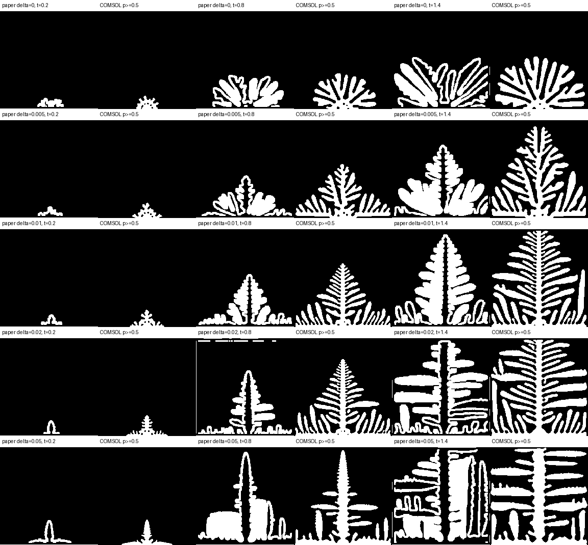

# Kobayashi 1993 MVP：总览

本案例展示 PaperSim 如何把一个论文复现问题推进到可审计结论，而不是只展示最终图像。

## 1. 复现范围

论文：Kobayashi 1993, *Modeling and numerical simulations of dendritic crystal growth*。

复现内容：

- Eq. (3)：相场演化方程；
- Eq. (4)：驱动力和各向异性本构关系；
- Eq. (5)：温度/焓平衡方程；
- Fig. 7：`delta` 扫描及四重枝晶形貌。

选择的值：

```text
delta = 0, 0.005, 0.01, 0.02, 0.05
tfinal = 1.4
comparison times = 0.2, 0.8, 1.4
```

## 2. 完整工作流

```text
论文 PDF + 目标
      │
      ▼
Case 初始化与命名校验
      │
      ▼
证据提取、单位校验、符号闭包和 IR 审计
      │
      ▼
人工批准 IR（绑定 paper/profile/IR 哈希）
      │
      ▼
build-only Java → built MPH
      │
      ▼
MPH 读回 → 实现审计
      │
      ▼
solve-only 参数扫描 → solved MPH + 导出
      │
      ├── 五组 delta 解
      ├── 网格敏感性
      ├── 时间步敏感性
      └── 初始半径敏感性
      │
      ▼
12 项 required acceptance
      │
      ▼
assess：qualified
      │
      ▼
完全离线的 report.html
```

## 3. 为什么使用不可变迭代

本轮全部事实固定在 `iter001`：

```text
iter001_ir.json
iter001_audit.json
iter001_build.java
iter001_solve.java
iter001_built.mph
iter001_solved.mph
iter001_results.csv
iter001_snapshot.json
```

如果模型假设、参数、方程或验收规则发生变化，应创建 `iter002`，而不是覆盖 `iter001`。这样最终报告可以回溯每个结论来自哪一轮模型事实。

## 4. 最终结果

| Metric | Actual | Rule | Result |
|---|---:|---:|---|
| Minimum phase field | `-3.644014e-6` | `>= -0.05` | PASS |
| Maximum phase field | `1.000001797` | `<= 1.05` | PASS |
| Enthalpy drift | `1.96206e-13` | `<= 0.01` | PASS |
| Fine-mesh tip difference | `0.00353607` | `<= 0.05` | PASS |
| Fine-time tip difference | `0.0` | `<= 0.05` | PASS |
| Initial-radius tip range | `0.00211416` | `<= 0.15` | PASS |
| Tip ratio: delta=.05 / delta=0 | `1.85093` | `> 1.02` | PASS |
| Directionality ratio | `2.01351` | `> 1.10` | PASS |
| Fig. 7 mean IoU | `0.328294` | `>= 0.25` | PASS |
| Fig. 7 normalized Chamfer | `0.0262006` | `<= 0.10` | PASS |
| COMSOL error count | `0` | `== 0` | PASS |

最终结论：

```text
state = assessed
verdict = qualified
reason = results pass under explicitly declared missing-paper assumptions
```

## 5. Fig. 7 对照



图中从左到右、每组两列分别为论文数字化轮廓和 `p >= 0.5` 的 COMSOL 轮廓。比较在 `192 x 192` 归一化网格上进行。

## 6. 阅读顺序

1. [Paper 到 IR](paper-to-ir.md)：论文事实如何进入可审计状态。
2. [IR 到 COMSOL](ir-to-comsol.md)：批准规格如何进入 build/solve 和 MPH 审计。
3. [求解与审计](solve-and-audit.md)：五组扫描、敏感性、Fig. 7 和最终 verdict。
4. [完整复现步骤](reproduce.md)：从安装到报告的逐步操作。
